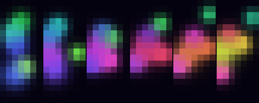

# ESP32 PIM545 Lava Lamp

A lava-lamp for a [Pimoroni Pico Scroll Pack (PIM545)](https://shop.pimoroni.com/products/pico-scroll-pack): **119 white LEDs in a 17×7 grid**, driven over I2C by an **ESP32** you plug into a Mac with USB-C.

The physics are the same heat-driven blobs as [green-building-lava-lamp](https://github.com/Rhoahndur/green-building-lava-lamp) (MIT Green Building, 17×9 RGB windows). This canvas is **7 wide × 17 tall** — hold the Scroll Pack like a building, buttons A/B at the roof.

The LEDs are white, so colour is folded down to brightness. Hot blobs still rise, cool blobs sink, they merge, split, and glow into each other.





## What you need

- An ESP32 development board with USB-C (classic ESP32, ESP32-S3, or ESP32-C3 SuperMini all work)
- A PIM545 Pico Scroll Pack
- Four jumper wires (male-to-male or male-to-female, depending on your ESP32 headers). Four more if you want the buttons
- The USB-C cable that already talks to the Mac

The Scroll Pack is a **Pico backpack**. It will not plug onto an ESP32. You poke jumper wires into the female Pico header.

## Wire it

**Power the pack from 3.3 V, not 5 V.** The IS31FL3731 has internal pull-ups to its VCC. If VCC is 5 V those pull-ups put 5 V on SDA/SCL and can kill ESP32 GPIOs (they are not 5 V tolerant). Pimoroni’s “power via VSYS” note assumes a Pico, whose VSYS is fine at 5 V. On an ESP32, feed **3.3 V into VSYS**.

| PIM545 (Pico header pin) | Function | ESP32 DevKit | ESP32-S3 / C3 SuperMini |
| --- | --- | --- | --- |
| **39 VSYS** | LED power | **3V3** | **3V3** |
| **3, 8, 18, or 38 GND** | Ground | **GND** | **GND** |
| **6 SDA** | I2C data | **GPIO 21** | **GPIO 8** |
| **7 SCL** | I2C clock | **GPIO 22** | **GPIO 9** |
| 16 SW_A (optional) | Pebble, top-right | GPIO 32 | GPIO 4 (S3) / GPIO 2 (C3) |
| 17 SW_B (optional) | Pebble, top-left | GPIO 33 | GPIO 5 (S3) / GPIO 3 (C3) |
| 19 SW_X (optional) | Pebble, bottom-right | GPIO 25 | GPIO 6 (S3) / GPIO 4 (C3) |
| 20 SW_Y (optional) | Pebble, bottom-left | GPIO 26 | GPIO 7 (S3) / GPIO 5 (C3) |

The underside of the pack is silkscreened. Match the USB-end marking with “USB” on the drawing, then count:

```
LED face, A/B at the top (roof), X/Y at the bottom (ground)

  B  [LEDs]  A          pin 1  is next to A
                        pin 6  SDA     pin 7  SCL
  left header           pin 16 SW_A    pin 17 SW_B
  pin 39 VSYS           pin 19 SW_X    pin 20 SW_Y
  pin 38 GND
  Y  [LEDs]  X
```

Minimum four wires:

```
ESP32 3V3  ----  PIM545 VSYS (39)
ESP32 GND  ----  PIM545 GND  (38 or 8)
ESP32 SDA  ----  PIM545 SDA  (6)
ESP32 SCL  ----  PIM545 SCL  (7)
```

USB-C from the Mac powers the ESP32; the ESP32’s 3.3 V regulator powers the matrix. 119 LEDs at the default brightness are within what a typical DevKit regulator will supply. If the ESP32 brown-outs, lower brightness (serial `-`).

I2C is 400 kHz, address **0x74**. Extra pull-ups are usually unnecessary; if the bus is flaky add 4.7 kΩ from SDA and SCL to 3.3 V.

## Flash the firmware

The sketch is Arduino-ESP32, no extra libraries. It lives in `firmware/pim545_lava_lamp/`.

### Arduino IDE

1. Install [Arduino IDE 2](https://www.arduino.cc/en/software)
2. **Settings → Additional boards manager URLs**, add  
   `https://espressif.github.io/arduino-esp32/package_esp32_index.json`
3. **Boards Manager**: install “esp32” by Espressif
4. Open `firmware/pim545_lava_lamp/pim545_lava_lamp.ino`
5. Pick your board and port
   - classic USB-C DevKit: **ESP32 Dev Module**
   - S3: **ESP32S3 Dev Module**, USB CDC on boot **Enabled**
   - C3 SuperMini: **ESP32C3 Dev Module**, USB CDC on boot **Enabled**
6. If the board is not a classic DevKit, edit `config.h` and set `PIM545_BOARD`:
   - `1` ESP32 DevKit (SDA 21, SCL 22) — default
   - `2` ESP32-S3 (SDA 8, SCL 9)
   - `3` ESP32-C3 SuperMini (SDA 8, SCL 9)
7. **Upload**
8. Open **Serial Monitor** at **115200 baud**

On success you should see `PIM545 ready.` and the matrix start moving. If you see `IS31FL3731 not found`, the firmware prints an I2C scan and the wiring checklist. Hold **A** during reset for a corner/edge test pattern (top-left, top-right, bottom-right, bottom-left, roof row, left column).

### PlatformIO

```sh
cd firmware
pio run -e esp32dev -t upload     # classic ESP32
pio run -e esp32-s3 -t upload     # ESP32-S3
pio run -e esp32-c3 -t upload     # ESP32-C3
pio device monitor
```

### Serial and buttons

| Control | Action |
| --- | --- |
| `a` `b` `x` `y` | Drop a pebble at that corner |
| `t` | Test pattern |
| `l` | Lava lamp |
| `p` | Pause / resume |
| `s` | New random seed |
| `+` / `-` | Brightness |
| `?` | Print help |
| Button A / B / X / Y | Pebble from that corner (ring + shove into the blobs) |

If the image is mirrored or rotated, change `SWAP_XY`, `FLIP_X`, and `FLIP_Y` at the bottom of `config.h` and reflash. Default is portrait, A/B at the roof.

## Preview on the Mac (no hardware)

Python 3.10+, no packages:

```sh
git clone https://github.com/Rhoahndur/esp32-pim545-lava-lamp.git
cd esp32-pim545-lava-lamp
python3 lava_lamp.py --preview --frames 0
```

`--mono` shows luminance, which is what the white LEDs actually display.

```sh
python3 lava_lamp.py --dry-run --frames 180 --seed 13 --dump-png still.png
```

## Stream from the Mac onto the matrix

The firmware also accepts frames over USB serial, same idea as the Green Building client pushing RGB to the simulator. After the sketch is running:

```sh
python3 -m pip install pyserial
python3 lava_lamp.py --serial            # auto-detects the USB port
python3 lava_lamp.py --serial /dev/cu.usbserial-0001 --fps 20
```

List ports with `ls /dev/cu.usb*`. Host frames win until USB goes quiet for 2.5 s, then the on-device lamp resumes.

Packet (124 bytes): `0x50 0x53 0x07 0x11` + 119 luminance bytes (row-major, origin top-left) + XOR of the previous 123 bytes.

## How the blobs work

Same knobs as the Green Building lamp. y increases downward; the ground floor is hot.

| Knob | Default | Role |
| --- | --- | --- |
| Bottom heat / roof cooling | `ambient_temp(y)` | Hot blobs rise (toward y = 0); cold blobs sink |
| `HEAT_RATE` | 0.22 | How quickly temperature follows the air |
| `BUOYANCY` | 3.4 | Strength of that rise / sink |
| `DRAG` | 0.55 | Caps terminal speed with `MAX_SPEED` (1.8) |
| `MERGE_FACTOR` | 0.32 | Overlapping blobs fuse when more than `MIN_BLOBS` (5) are alive |
| `SPLIT_RADIUS` / `SPLIT_TEMP` | 3.15 / 0.68 | Large hot blobs can split, up to `MAX_BLOBS` (7) |
| `BACKGROUND` | `(5, 2, 15)` | Dark fluid, visible as a dim glow on white LEDs |
| `Y_ASPECT` | 1.0 | Square pixels on this pack (the building used 0.85) |
| `GAUSS_FALLOFF` | 2.5 | Soft metaball edges |

`--fps` sets `dt = 1/fps`. `--seed 13 --fps 20` always produces the same Python frames.

## Troubleshooting

| Symptom | Likely cause |
| --- | --- |
| Serial says nothing found, scan empty | SDA/SCL swapped, missing GND, pack unpowered, charge-only USB cable |
| Found some other address, not 0x74 | Different I2C device on the same pins; move SDA/SCL |
| ESP32 resets when LEDs light | 3.3 V rail sagging; lower brightness, or power the pack from a 3.3 V supply that shares GND |
| Image is sideways | `SWAP_XY` — should be `1` for portrait |
| Image is mirrored | Toggle `FLIP_X` or `FLIP_Y` |
| Only some LEDs work | Enable mask is for this pack; do not substitute a different IS31FL3731 board without changing the driver |
| S3/C3 uploads but Serial is dead | Enable USB CDC on boot in the board settings |

Datasheet: [IS31FL3731](https://cdn.shopify.com/s/files/1/0174/1800/files/31FL3731_f2c53799-e354-4fe7-8111-71cfdacf2712.pdf). Pack pinout: [Pimoroni shop page](https://shop.pimoroni.com/products/pico-scroll-pack).

MIT licensed; see `LICENSE`.
